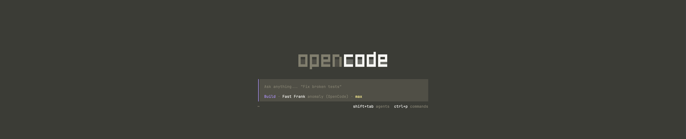

# DropCode

A warm, drop-down AI coding terminal.



DropCode embeds [`libghostty`](https://ghostty.org) and starts its terminal
session when the app launches, so your agent is ready before the panel appears.
Ghostty.app is not required.

- Tap `Control+Command` to toggle the panel.
- Hold `Control+Command` to show it until you release the keys.
- Launch OpenCode, Codex, Claude, or any custom shell command.
- Adjust panel height and window opacity from the menu-bar settings.
- Keep the colors and theme configured by the launched CLI.

## Download

macOS builds are available from [GitHub Releases](https://github.com/glowdotjpeg/drop-code/releases).
Unzip the archive and move `DropCode.app` to Applications.

The Windows fork is a native C++ implementation in [`Windows`](Windows). It
uses Win32, ConPTY, Direct2D, DirectWrite, and `libvterm`; WinUI 3 is limited to
the settings window.

## Windows

Windows releases require the matching [Windows App Runtime](https://learn.microsoft.com/en-us/windows/apps/windows-app-sdk/downloads)
2.3.1 x64 runtime. Build from a Visual Studio developer environment:

```powershell
.\Windows\scripts\build.ps1
.\Windows\scripts\package-release.ps1
```

## Build

### macOS

Requires macOS 13 or newer, Xcode, and your chosen agent CLI on `PATH`.

```sh
./scripts/build-app.sh
open .build/DropCode.app
```

Builds are ad-hoc signed by default. To use an Apple signing identity:

```sh
SIGNING_IDENTITY="Apple Development: Your Name (XXXXXXXXXX)" ./scripts/build-app.sh
```
